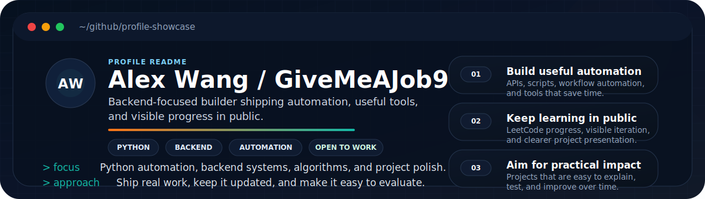
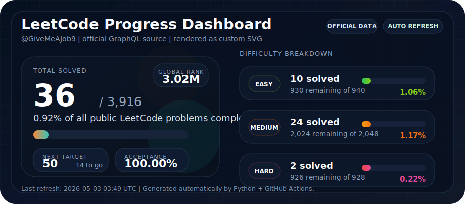
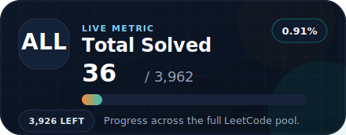
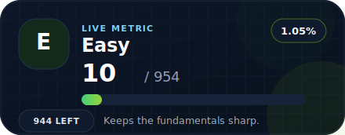
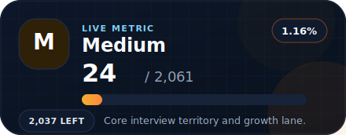
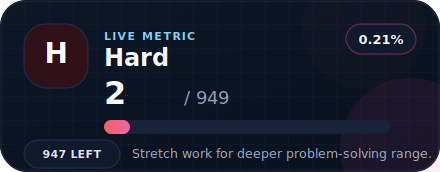

  

<h1 align="center">GiveMeAJob9</h1>

  Building in public with Python, problem solving, and steady progress.

  
  
  
  

## Snapshot

| Area | Details |
| --- | --- |
| Name | Alex Wang |
| Base | New York, USA |
| Focus | Python automation, backend engineering, algorithms, and project polish |
| Open To | Software engineering opportunities with strong backend or product-building ownership |

## Why This Profile Exists

I use this profile as a living snapshot of how I learn, build, and improve in public.

- I document consistent progress instead of only polished end results.
- My current focus is Python, data structures and algorithms, automation, and clearer project presentation.
- If you are hiring or exploring my work, the pinned repositories below are the fastest way to see how I think and ship.

## Toolbox

  
  
  
  
  

## Featured Projects

<table>
  <tr>
    <td width="50%" valign="top">
      <h3>Bear Review</h3>
      

        <a href="https://github.com/GiveMeAjob-job/Bear-Review"><strong>Open Repository</strong></a>
      

      
Automates Notion task reviews into AI-generated daily, weekly, and monthly summaries.

      
<code>Python</code> <code>Notion API</code> <code>GitHub Actions</code> <code>LLM</code>

      
Good signal for workflow automation, API integration, and shipping useful internal tools.

    </td>
    <td width="50%" valign="top">
      <h3>Online Note System</h3>
      

        <a href="https://github.com/GiveMeAjob-job/online-note-system"><strong>Open Repository</strong></a>
      

      
Backend service for notes, auth, categories, tags, statistics, and real-time updates.

      
<code>Node.js</code> <code>Express</code> <code>MongoDB</code> <code>WebSocket</code>

      
Shows REST API design, authentication flows, logging, and backend structure.

    </td>
  </tr>
  <tr>
    <td width="50%" valign="top">
      <h3>Mech-Exo</h3>
      

        <a href="https://github.com/GiveMeAjob-job/Mech-Exo"><strong>Open Repository</strong></a>
      

      
Systematic trading and research platform with data pipelines, risk tooling, execution, and reporting.

      
<code>Python</code> <code>DuckDB</code> <code>Prefect</code> <code>Dash</code>

      
Highlights larger-scale architecture, automation, and data-heavy engineering work.

    </td>
    <td width="50%" valign="top">
      <h3>LeetCode Progress</h3>
      

        <a href="https://github.com/GiveMeAjob-job/leetcode-progress"><strong>Open Repository</strong></a>
      

      
Automatically syncs LeetCode progress into a visual README using generated SVG assets.

      
<code>Python</code> <code>SVG</code> <code>GitHub Actions</code> <code>Automation</code>

      
Useful example of turning raw stats into a clean developer-facing presentation.

    </td>
  </tr>
</table>

## Best Entry Points

- Start with [Bear Review](https://github.com/GiveMeAjob-job/Bear-Review) if you want to see automation, APIs, and AI-assisted workflows.
- Open [online-note-system](https://github.com/GiveMeAjob-job/online-note-system) for a more classic backend project structure.
- Check [Mech-Exo](https://github.com/GiveMeAjob-job/Mech-Exo) for broader system design, pipelines, and reporting.
- Browse [leetcode-progress](https://github.com/GiveMeAjob-job/leetcode-progress) if you want to see lightweight automation and profile presentation work.

## LeetCode Dashboard

<!-- LEETCODE_STATS:START -->

  

  
  

  
  

<table>
  <tr>
    <th>Difficulty</th>
    <th>Solved</th>
    <th>Total</th>
    <th>Completion</th>
  </tr>
  <tr>
  <td>Easy</td>
  <td><b>10</b></td>
  <td>940</td>
  <td>1.06%</td>
</tr>
<tr>
  <td>Medium</td>
  <td><b>24</b></td>
  <td>2,048</td>
  <td>1.17%</td>
</tr>
<tr>
  <td>Hard</td>
  <td><b>2</b></td>
  <td>927</td>
  <td>0.22%</td>
</tr>
<tr>
  <td>Total</td>
  <td><b>36</b></td>
  <td>3,915</td>
  <td>0.92%</td>
</tr>
</table>

  Last refresh: 2026-04-29 03:40 UTC | Source: official LeetCode GraphQL | Synced via GitHub Actions

<!-- LEETCODE_STATS:END -->

## What This Repo Shows

| Signal | Why it matters |
| --- | --- |
| Consistency | Daily-updated LeetCode stats make progress visible. |
| Automation | A Python script plus GitHub Actions keep the profile current without manual edits. |
| Communication | The README is designed as a profile landing page, not just a project note. |

## Behind the Scenes

- `Leetcode_stats.py` fetches public LeetCode data from the official GraphQL endpoint and renders custom SVG cards.
- `.github/workflows/leetcode.yml` refreshes the dashboard every day and commits only the generated assets.
- The `images/` directory stores the visual pieces that GitHub renders directly on the profile.

## Reach Out

  <a href="https://github.com/GiveMeAjob-job">GitHub</a> |
  <a href="https://leetcode.com/GiveMeAJob9/">LeetCode</a> |
  <a href="https://github.com/GiveMeAjob-job?tab=repositories">Projects</a>

  If you are hiring, collaborating, or just want to talk through a project, this profile is the best starting point.

